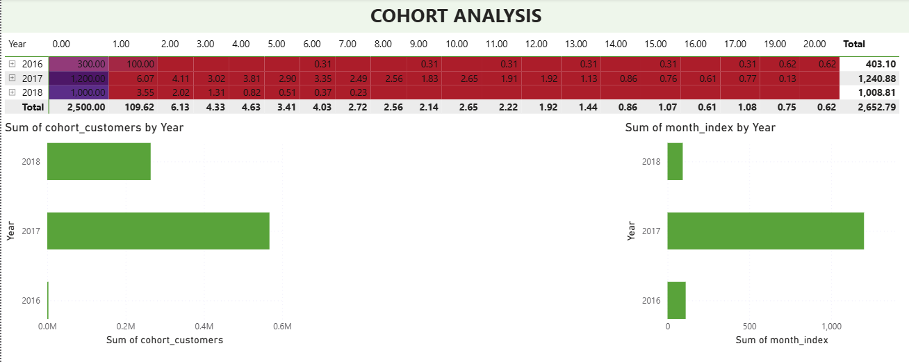

# 🛒 Olist E-commerce Business Intelligence Platform

> An end-to-end Business Intelligence project built using PostgreSQL, SQL, Power BI, and DAX to analyze the Brazilian Olist E-commerce dataset.

---

## 📌 Project Overview

This project analyzes the Brazilian Olist E-commerce dataset to generate business insights across sales, customers, products, sellers, operations, and customer experience.

The solution was developed as a complete Business Intelligence platform using PostgreSQL for data storage and SQL analysis, and Power BI for interactive dashboards and advanced analytics.

The project includes:

- Executive Business Dashboard
- Sales Analytics
- Customer Analytics
- Product Analytics
- Seller Analytics
- Operations Dashboard
- Customer Experience Dashboard
- RFM Customer Segmentation
- Cohort Analysis

---

## 🎯 Business Objectives

This project answers business questions such as:

- Which product categories generate the highest revenue?
- Which states contribute the most sales?
- Who are the most valuable customers?
- Which sellers perform the best?
- How efficiently are orders delivered?
- How satisfied are customers?
- Which customer segments should marketing target?
- How well are customers retained over time?

## 🛠️ Tech Stack

| Category | Technologies |
|----------|--------------|
| Database | PostgreSQL |
| Query Language | SQL |
| Data Visualization | Power BI |
| Data Modeling | Star Schema |
| Analytics | DAX |
| Version Control | Git & GitHub |

---

## 📂 Dataset

**Dataset:** Brazilian Olist E-commerce Dataset

The dataset contains approximately **100,000 orders** placed between **2016 and 2018** on the Olist marketplace in Brazil.

### Tables Used

| Table | Description |
|-------|-------------|
| customers | Customer information |
| orders | Order details |
| order_items | Product-level order information |
| payments | Payment information |
| products | Product details |
| sellers | Seller information |
| reviews | Customer reviews |
| category_translation | Product category translation |

📌 Dataset Source: https://www.kaggle.com/datasets/olistbr/brazilian-ecommerce

---

## 🏗️ Data Model

The project follows a relational data model built in PostgreSQL and imported into Power BI using a Star Schema approach.

### Data Model

---

## 📈 Key Features

- Interactive Power BI dashboards
- SQL-based business analysis
- PostgreSQL relational database
- Star Schema data model
- DAX measures and KPIs
- RFM Customer Segmentation
- Cohort Analysis
- Business-focused insights and recommendations

  ---

---

# 📊 Dashboard Gallery

## 📌 Executive Business Overview

Provides a high-level overview of business performance through KPIs including revenue, orders, customers, average order value, review score, and delivery performance.

---

## 📈 Sales Analytics

Analyzes monthly sales trends, product category performance, payment methods, and top-selling products to identify revenue drivers.

---

## 👥 Customer Analytics

Examines customer distribution, repeat customers, customer lifetime value, top cities, and revenue generated by customers.

---

## 📦 Product Analytics

Provides insights into product categories, pricing, freight charges, and product performance across different categories.

---

## 🏪 Seller Analytics

Evaluates seller performance using revenue, orders, seller ratings, geographic distribution, and top-performing sellers.

---

## 🚚 Operations & Logistics

Monitors delivery performance, freight costs, processing time, late deliveries, and operational efficiency.

---

## ⭐ Customer Experience

Analyzes review scores, customer satisfaction, delivery impact on ratings, and review distribution.

---

## 🎯 RFM Customer Segmentation

Segments customers into Champions, Loyal Customers, Potential Loyalists, At Risk, Lost Customers, and New Customers using Recency, Frequency, and Monetary analysis.

---

## 📅 Cohort Analysis

Visualizes customer retention across cohorts to understand repeat purchase behavior and long-term customer retention trends.

---
